| Title                                | Description                              | Tags                    |
|--------------------------------------|------------------------------------------|-------------------------|
| MemeBox 101 - Introduction and setup | A guide on how to set up and use MemeBox | memebox, obs, streaming |

Welcome to this MemeBox 101 series where we will go over on how to download,
install, configure and use [MemeBox](MEMEBOX_GITHUB_URL).

# What is MemeBox?

    

A complete management app for
[image / audio / video / iframe / widgets](https://github.com/negue/meme-box/blob/develop/tutorials/type_overview.md)
"media" to be used inside OBS. Or trigger other custom actions.

# What would I use this for?

Well with MemeBox you can do a lot of amazing things that can add a bit of flare
to your live streams or video recordings. The great thing about MemeBox is that
it can be used for the simplest things or for more advanced once such as triggering
certain action based on events or triggers.

# How do I get started?

To get started first pick out which version you want to download and go with that,
this guide should be compatible with both stable and nightly release, but I will be
using the nightly build trough this guide.

# Where can I get it?

There are a few places where you can get it.

Download the [latest release!](MEMEBOX_GITHUB_RELEASE_URL) (currently a bit out of date, new release soon) - the
latest [nightly builds](MEMEBOX_GITHUB_NIGHTLY_RELEASE_URL) (the latest version, but might have some breaking changes or unstable features.)

## Which version should I get?

This totally depends on you, and what you want. If you only want to test out
the software and see what it is and how to use it, you can go for the latest release
or if you want to check out the latest features that might still be a bit unstable than you can go for the nightly release, but you get access to the newest features that way.

My personal recommendation is the nightly build, but this up to you. :)

# Downloading the software

At the time of writing this the latest nightly release is
[nightly-release-20220204](https://github.com/negue/meme-box-nightly/releases/tag/nightly20220204)
and the stable release is [Release V2021.2.1](https://github.com/negue/meme-box/releases/tag/2021.2.1).

On the release page you will be presented with the option to download multiple
versions of the MemeBox software.

* `com.memebox.memebox-streamdeck.streamDeckPlugin`
  * This is a plugin that adds MemeBox controls to the [Streamdeck](https://www.elgato.com/en/stream-deck)
* `memebox-electron.AppImage`
  * This is a file running a desktop version of MemeBox on Linux
* `memebox-headless.exe`
  * This is a file running a headless version of MemeBox on Windows
* `memebox-linux-headless`
  * This is a file running a headless version of MemeBox on Linux
* `memebox-mac-electron.dmg`
  * This is a file running a desktop version of MemeBox on Mac
* `memebox-macos-headless`
  * This is a file running a headless version of MemeBox on Mac
* `memebox-windows-electron.exe`
  * This is a file running a desktop version of MemeBox on Windows (installer)
* `memebox-windows-electron.zip`
  * This is a file running a desktop version of MemeBox on Windows (manual installation)

   

Difference between headless and non-headless versions is that the non-headless
version ship with a full desktop application that starts up when you run MemeBox
on your computer, and you can control and setup everything from there. Whereas
the headless version only starts the services needed for everything to run, but
in order to access the interface of the application you need to use your browser.

***NOTE***
I will be downloading and running the ***nightly*** release of `memebox-headless.exe`

***Note*** certain operating system such as Linux and/or Mac might require you
to add the executable flags to the downloaded file before being able to run it.

To add the flag just run the command `chmod +x memebox-file-name`.

During the download process your download might be stopped by your browser because
it thinks the file you're downloading might be dangerous, but that is just because
the files are not (as of writing this) digitally signed.

To download the file use the keep option from you browser, for me in Chrome it
looks like this:

By clicking on the little caret (^) icon it shows me the `Keep` options.

# First startup

After you have successfully downloaded the software now is the time to actually
run it and configure it for use.

To start up the application either run the headless version file you downloaded
for your operating system or search within your installed application for the
installed non-headless version to run it.

***NOTE for Windows users***

During your **first** run of the application, your PC might prompt you with a screen
that looks like this:

To still be able to run the application, you can click on the text that says:
`More info` and get the `Run anyway` button which will run the application.
On the subsequent runs you will not be seeing this prompt unless you download a
new version of the software.

# Configuring MemeBox

When you first open up your MemeBox, if you have downloaded the non-headless
version than it should open up the user interface for you, or if you have downloaded
the headless version you can open your browser and enter an address:
`localhost:<PORT_NUMBER>`. The `<PORT_NUMBER>` will differ depending on which
version you have downloaded. As of writing this, the stable version of the app
runs on the port number `4444` and the nightly build runs on the port `6363`.

In my case the full address would look like: [`localhost:6363`](http://localhost:6363/).

***NOTE*** if you're running your app from the command line, there is an option
to pass the `--port` flag as well and specify on which port number you want your
user interface to be available at. You can find out more in the
[Command line options](https://github.com/negue/meme-box/blob/develop/tutorials/installation.md#commandline-options)
section of the official guide.

# First run

When you open up MemeBox for the first time you should be presented with the 
screen that looks similar to this one:

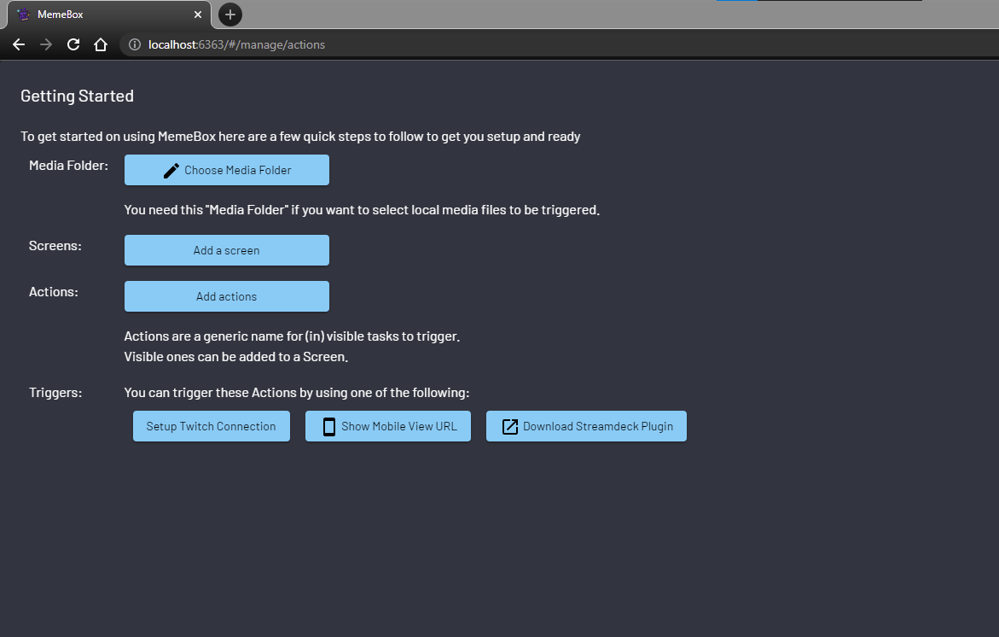

On this screen you get to set up your media folder location, add your first screen
that can be added to [OBS](OBS_URL), add your first MemeBox action and also connect with 
your Twitch account.

## Choose Media Folder

Clicking on the `Choose Media Folder` button will prompt you with a dialog that 
lets you pick a folder on your PC that will store all of your MemeBox media files
such as: images, video, gifs etc.

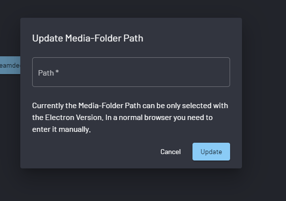

As the message says in the screenshot, if you're running a headless version of the app,
you will have to specify your media folder manually, but if you're running an 
electron version than you will be presented with a folder picker dialog. 

After selecting or manually entering  the media folder path and clicking on the 
update button your screen should reflect that by showing the text 
~~Choose Media Folder~~ text.

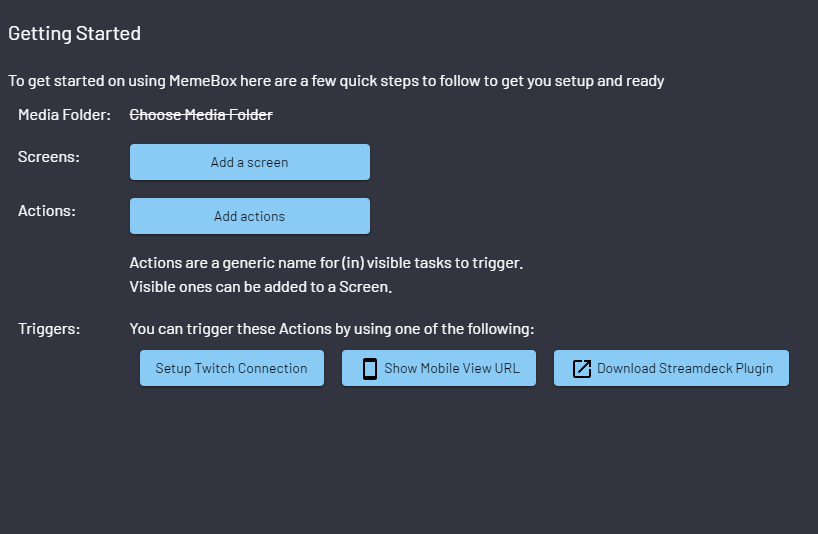

## Adding a screen

Your next step in setting up your MemeBox is adding a new screen that will allow
you to show your media inside of [OBS](OBS_URL). Clicking on the `Add a screen`
button will let you create a new screen with some properties depending on your setup.

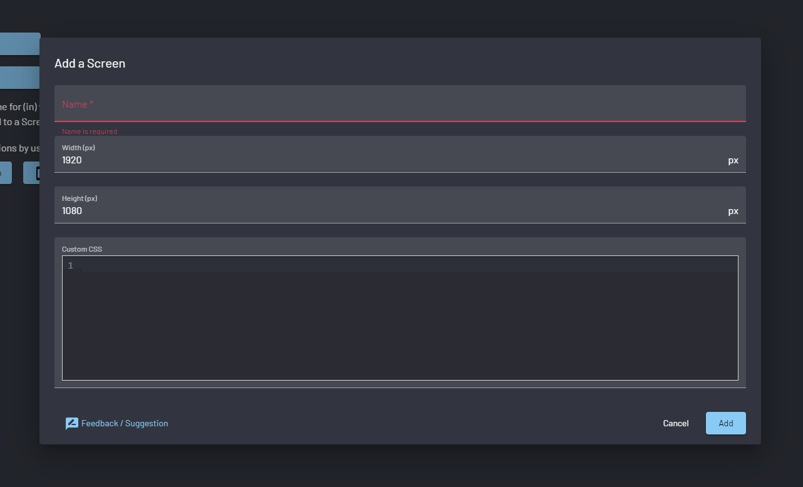

On this form you can give your new screen a name, set its width and height and 
apply any custom CSS properties and styles that you want. 

Once the new screen has been added, you should see something similar to the following

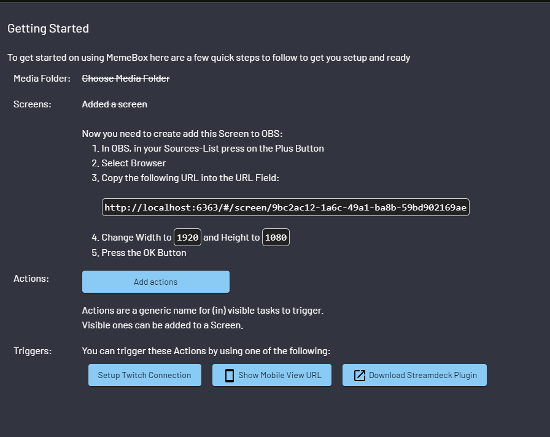

The screen url (in my case: `http://localhost:6363/#/screen/9bc2ac12-1a6c-49a1-ba8b-59bd902169ae`)
is generated based on certain criteria and may not have the same hash value as mine does.

As shown in the image above, it will also give you a small guide on how to add your new 
screen to [OBS](OBS_URL) as well

### Adding your screen to OBS

In your OBS, under the `Sources` section you can click on a small + (plus) icon

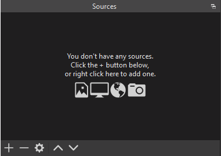

this will let you choose what kind of source do you want to add, and you're 
supposed to pick a `Browser` as a source.

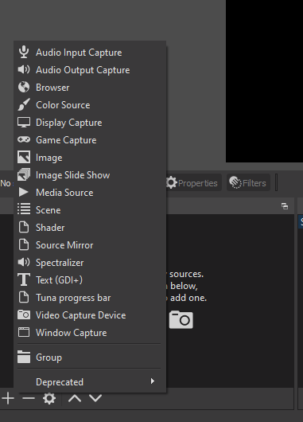

This will prompt you with a new dialog where you can create a new source or pick 
an already existing one if you have done this before.

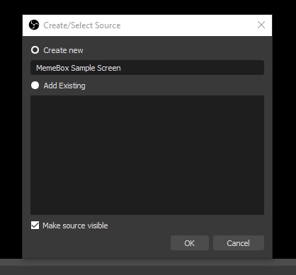

We will use the `Create new` radio button option and specify a name for our new source.
In this example I've gone with `MemeBox Sample Screen` but you can enter what ever you want.

After clicking on the `OK` button a new dialog will appear which will let you configure 
your new source. 

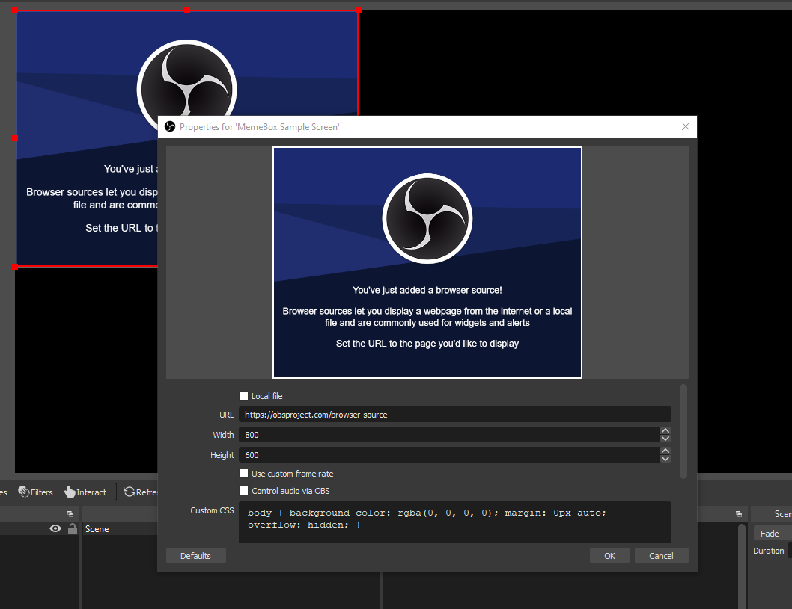

In the `URL` input box paste the URL that you saw in the MemeBox's first screen after 
you have successfully created your first screen and for the `Width` and `Height` 
fields use the same values that you specified for your screen as well.

One good option to turn on here as well is to check the box that says `Control audio via OBS`
this will let you control the audio levels of the media files being played by MemeBox.

***Note*** MemeBox does have its own separate audio control settings for certain media types.

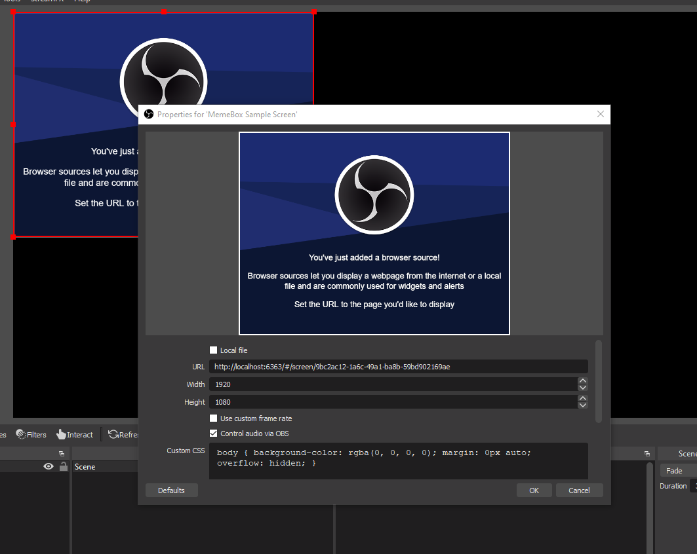

After you're done with this click on the `OK` button to save your changes and that should be it 
for OBS setup, and we can return to our MemeBox to finish setting everything up there.

***Note*** You can leave OBS open or open it up later so that we can preview our newly added media files.

## Adding MemeBox actions

If we go back to our MemeBox and click on the `Add actions` button, you will be presented
with a form that lets you add/create a new MemeBox action. In older versions this was called 
a clip or media but with the latest additions such as scripts, widgets everything got renamed
into action. 

***Note*** There could still be some old labels left unchanged :)

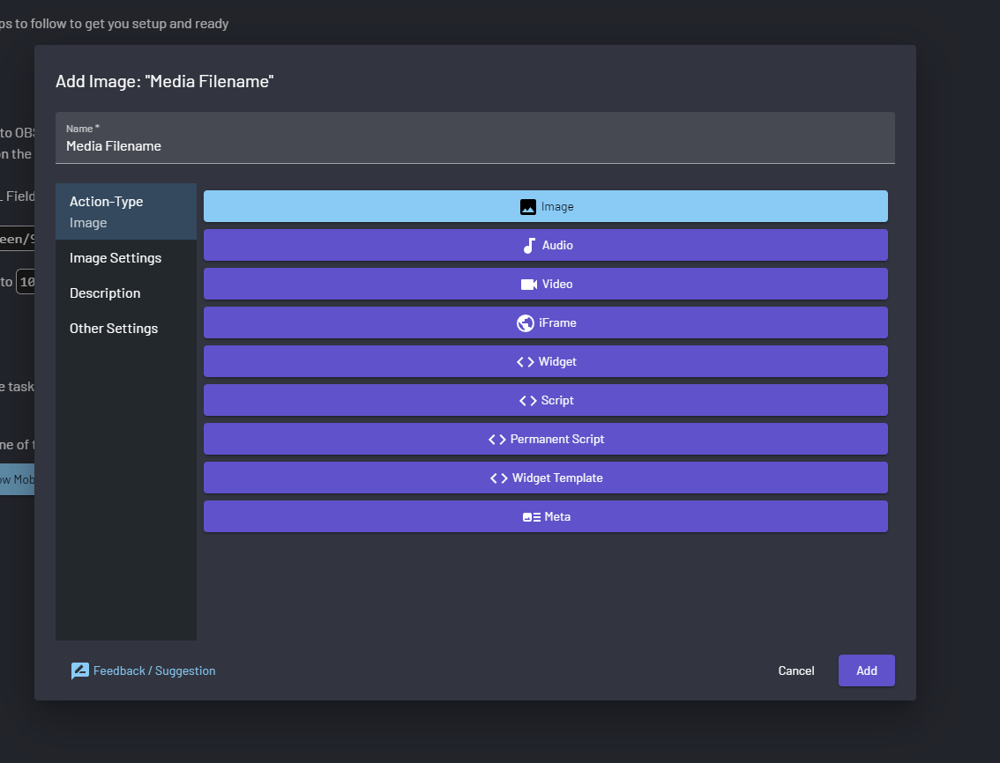

In this dialog you're able to pick which type of action you're adding and specify any 
of the different properties based on the selected type. In this example I'll 
focus on adding an `Image`

In the `Name` input box we can specify the name for this action or let MemeBox 
pick one for us based on the file name that we select. I'll use the `Hello` for the name.

Next up, select the `Image settings` option in the dialog which will let you
choose which image you want to use. 

***NOTE*** this file needs to be added to your MemeBox media folder that we specified in 
the "[Choose media folder](#choose-media-folder)" section.

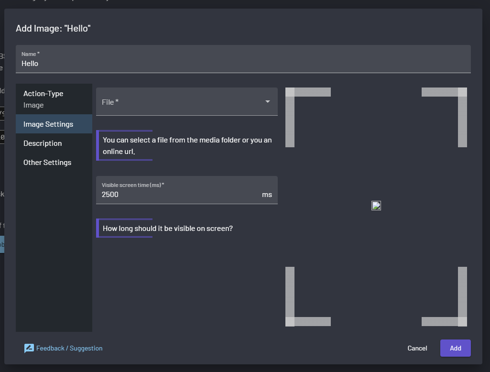

Under the `File` input you can select which image file you want to use from your 
media folder or paste a link from an online source.

After selecting the file you want use, it will show that files preview on the right side.

Here we can also configure for how long this image will be visible on screen before going away.

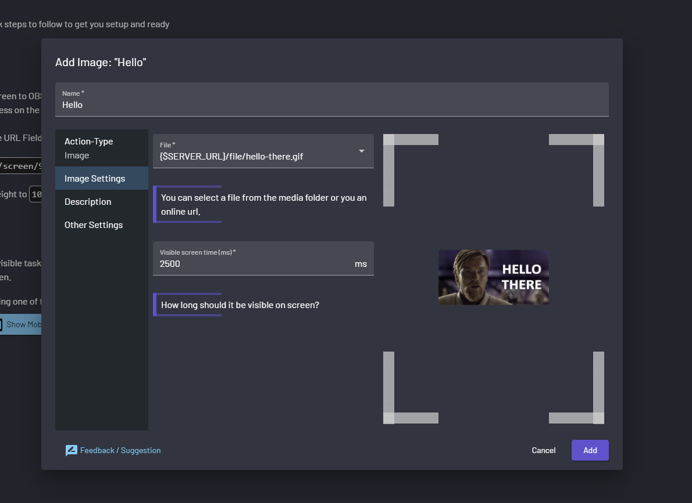

Under the `Description` section you can specify a description for the new 
MemeBox action to help you identity what each action does or is 
(this is very usefully when working with scripts and widgets).

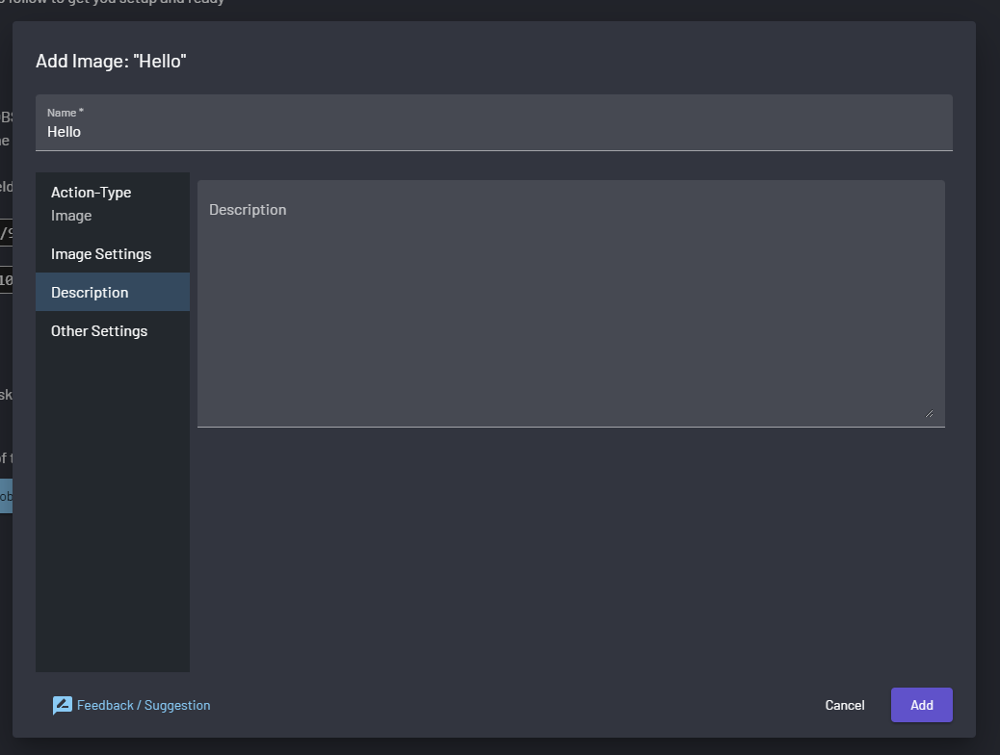

Under the `Other Settings` you can assign tags to your actions which can 
than be used to trigger all the action with the same tag with the help of `Meta` actions.

You can also specify in which queue you want your action to be and also add your
action to a MemeBox screen. Here we will select the screen we created in the 
"[Adding a screen](#adding-a-screen)" section, because every action needs to be 
assigned to a screen before it can be shown in OBS.

Once we have made all the changes that we wanted to, we can click on the `Add`
button to save it all.

## Twitch connections (Optional)

This step is fully optional and can be later done through the settings page of MemeBox.
If you do not wish to set up your twitch connection details at this point click on the 
`Close` button in the bottom right corner of your MemeBox screen

After we are done adding our new action to MemeBox, all we have left to do is 
add our [Twitch](https://twitch.tv) connection details, so that we can access all
the features of MemeBox such as chat message triggers or different twitch event 
such as bits, gifted subs, bans, raids etc. 

By clicking on the `Setup Twitch Connections` button we are presented with a new 
dialog where we can specify different things.

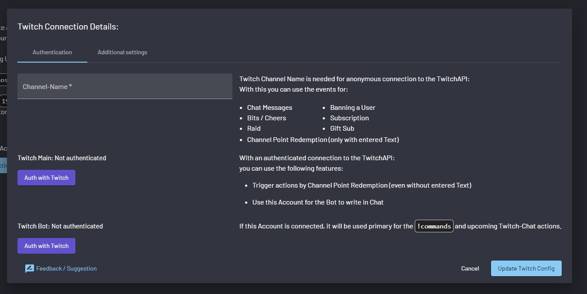

The Twitch connections dialog is split into two tabbed sections, the first is 
labeled as `Authentication` and the other one is labeled `Addidtional settings`

### Authentication tab

Under the `Authentication` tab of Twitch connection settings we can specify your
Twitch channel username and also authenticate MemeBox with your and your bots 
(can be the same account if you want or don't have a bot account) account to let 
your actions react to channel points and/or send messages in your own chat.

If you do not wish to set up any additional settings you can click on the 
`Update Twitch Config` button to save your changes and close the dialog. 

### Additional settings tabs (optional)

Here you can enable chat message replay for the `!commands` command or specify a
custom command name that will send a replay in your chat with all the available 
MemeBox actions that can be triggered via chat commands.

***NOTE*** Chat command triggered action will be covered in a later article.

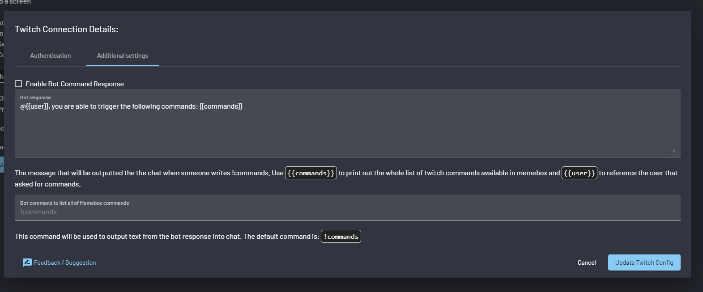

After clicking on the `Update Twitch Config` button your changes will be saved and the dialog will close.

With all of that done your `Getting started` screen should look similar to this:

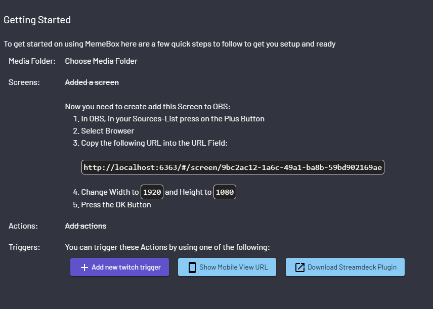

If you **HAVE** set up your twitch connections you will be able to add twitch 
triggers, which we will cover in a later article. 

Now you can click on the `Close` button in the bottom right corner to close this 
getting started screen and should be presented with something similar to following:

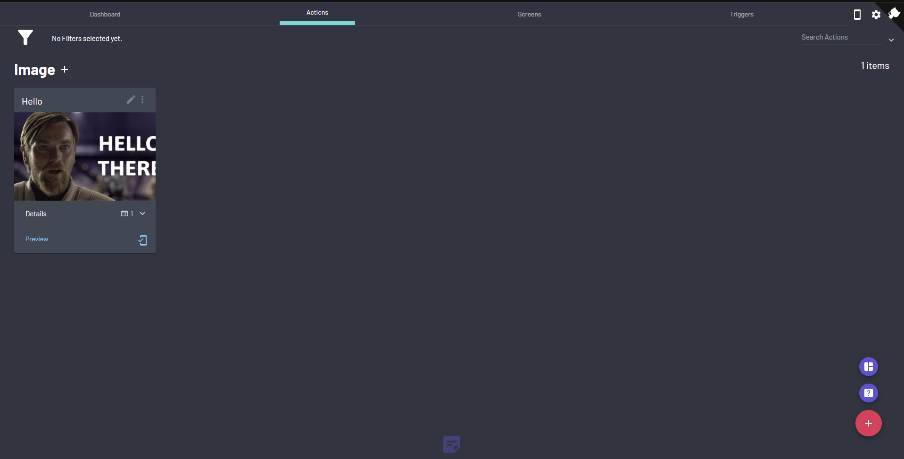

With this you have completed your first setup and run of MemeBox. 
Now you can add more actions by clicking on the red + (plus) button in the bottom
right corner and follow same steps as we did in the "[Adding memebox actions](#adding-memebox-actions)" 
section.

To make sure that everything works, we can click in the `Preview` button on our 
`Hello` image and see it show up in our OBS.

[MEMEBOX_GITHUB_URL]:https://github.com/negue/memebox
[MEMEBOX_GITHUB_RELEASE_URL]:https://github.com/negue/meme-box/releases
[MEMEBOX_GITHUB_NIGHTLY_RELEASE_URL]:https://github.com/negue/meme-box-nightly/releases
[OBS_URL]:https://obsproject.com/
